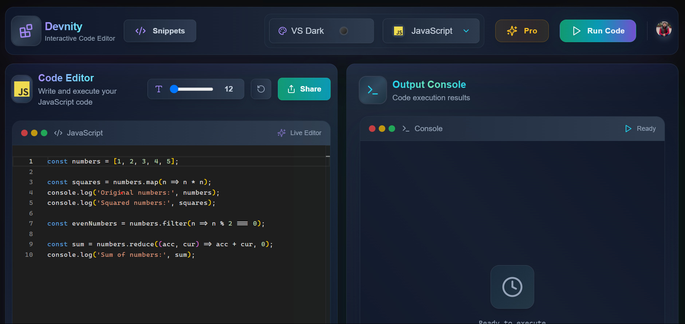
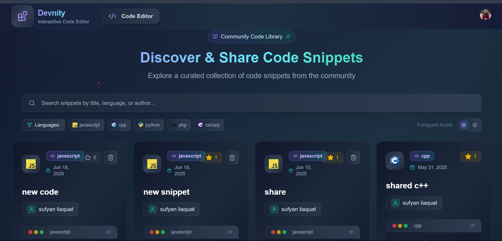
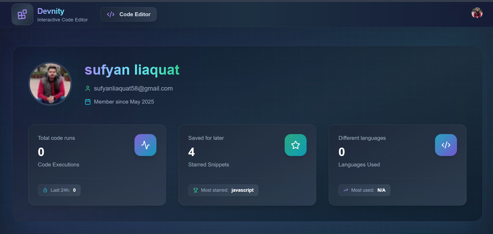
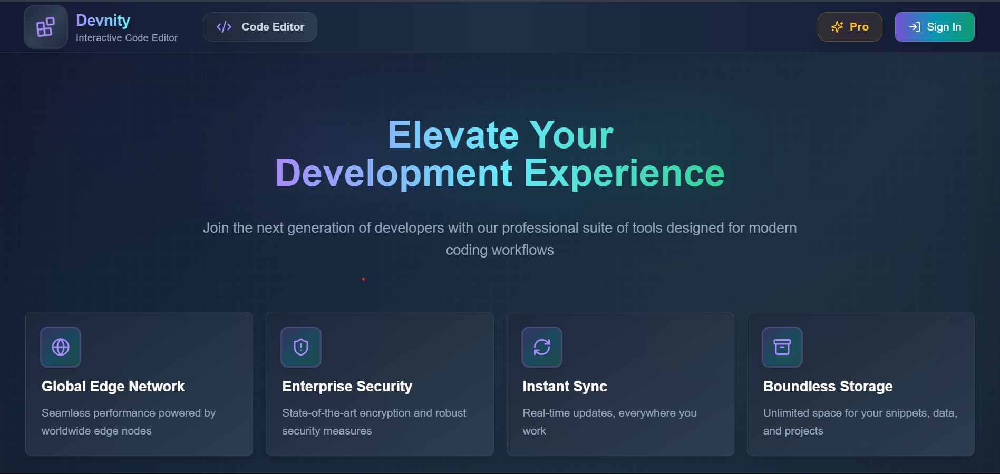

# Devnity – Interactive Code Editor

[](https://nextjs.org)
[](https://tailwindcss.com)
[](https://convex.dev)
[](https://clerk.com)
[](https://devnity-livid.vercel.app/)
[](LICENSE)

---

## 🚀 Live Demo

**[🌐 Visit Devnity Live](https://devnity-livid.vercel.app/)**

Experience the full power of Devnity in action! Try coding, sharing snippets, and collaborating with the community.

---

## 📖 Table of Contents

- [Overview](#overview)
- [✨ Features](#features)
- [🖼️ Screenshots](#screenshots)
- [🎯 Getting Started](#getting-started)
- [📋 Usage](#usage)
- [🛠️ Technologies Used](#technologies-used)
- [🚀 Deployment](#deployment)
- [🤝 Contributing](#contributing)
- [📄 License](#license)
- [👥 Team](#team)

---

## Overview

**Devnity** is a modern, responsive, beautiful and feature-rich web-based code editor built with [Next.js](https://nextjs.org), Tailwind CSS, and Convex. It offers an interactive coding environment with real-time editing, sharing, comments, and a beautiful, accessible UI. Designed for developers who want a seamless, collaborative, and social code editing experience.

---

## ✨ Features

- 🖊️ **Monaco-based Code Editor** with syntax highlighting, multiple language support, and custom themes
- 🚀 **Instant Code Execution** - Run code in 15+ programming languages instantly
- 💬 **Real-time Comments** - Engage with the community through threaded comments on snippets
- ⭐ **Social Features** - Star and save your favorite code snippets
- 👤 **Authentication** - Secure sign-in and user management with Clerk
- 📱 **Fully Responsive** - Optimized for both desktop and mobile devices
- 🎨 **Stunning UI** - Beautiful gradient themes and smooth transitions
- ⚡ **Performance** - Fast, lazy-loaded, and production-optimized
- 🤖 **AI-Powered Code Correction** - Fix errors with AI assistance
- 🔗 **Instant Sharing** - Share code snippets via unique URLs
- 📊 **User Profiles** - Track your coding activity and starred snippets
- 🌙 **Multiple Themes** - Customize your coding environment

---

## 🖼️ Screenshots


### 💻 Code Editor


### 📝 Snippets


### 👤 User Profile


### 💰 Pricing


---

## 🎯 Getting Started

### Prerequisites

- [Node.js](https://nodejs.org/) v16 or later
- npm, yarn, or pnpm
- A [Convex](https://convex.dev) account
- A [Clerk](https://clerk.com) account

### Installation

```bash
git clone https://github.com/yourusername/Devnity.git
cd Devnity
```

```bash
npm install
# or
yarn install
# or
pnpm install
```

### Set up environment variables

Create a `.env.local` file and add:

```env
NEXT_PUBLIC_CONVEX_URL=your_convex_url
CONVEX_DEPLOYMENT=your_convex_deployment

NEXT_PUBLIC_CLERK_PUBLISHABLE_KEY=your_clerk_publishable_key
CLERK_SECRET_KEY=your_clerk_secret_key
CLERK_FRONTEND_API_URL=clerk_frontend_api_url

GOOGLE_API_KEY=your_gemini_api_key
```

### Set up Convex

```bash
npx convex dev
```

### Run the development server

```bash
npm run dev
# or
yarn dev
# or
pnpm dev
```

Visit [http://localhost:3000](http://localhost:3000)

---

## 📋 Usage

### 🖊️ Writing Code

- 10+ language support
- Syntax highlighting & auto-completion
- Theme customization
- Instant execution

### 🚀 Sharing Snippets

- Save and share via URLs
- Titles, tags, and organization

### 💬 Community Interaction

- Comments, stars, and follows

### 👤 Profile Management

- Execution history, favorites, and activity

---

## 🛠️ Technologies Used

| Technology | Purpose | Version |
|------------|---------|---------|
| Next.js | React framework for web | 14.x |
| Tailwind CSS | CSS utility framework | 3.x |
| Monaco Editor | Code editor engine | Latest |
| Convex | Backend as a service | Latest |
| Clerk | Authentication | Latest |
| Framer Motion | UI animations | Latest |
| Zustand | State management | Latest |
| React Hot Toast | Notifications | Latest |
| Lucide React | Icons | Latest |

---

## 🚀 Deployment

### Vercel (Recommended)

[](https://vercel.com/new/clone?repository-url=https://github.com/yourusername/Devnity)

1. Push to GitHub
2. Connect on Vercel
3. Add environment variables
4. Deploy 🚀

### Manual

```bash
npm run build
npm start
```

Docs: [Next.js Deployment](https://nextjs.org/docs/app/building-your-application/deploying)

---

## 🤝 Contributing

### 🐛 Bug Reports

- Use [issues](https://github.com/yourusername/Devnity/issues)

### 💡 Feature Requests

- Submit [feature requests](https://github.com/yourusername/Devnity/issues/new?template=feature_request.md)

### 🔧 Workflow

```bash
# Fork -> Branch -> Code -> PR
```

Follow coding style, test well, and write clean commits.

---

## 🎯 Roadmap

- [ ] Real-time Collaboration
- [ ] Code Templates
- [ ] Plugin System
- [ ] Mobile App
- [ ] Analytics Dashboard
- [ ] Team Workspaces
- [ ] Git Integration
- [ ] Code Review Tools

---


## 🙏 Acknowledgments

- Monaco Editor
- Convex
- Clerk
- Vercel
- Open Source Community

---

## 📞 Support

- 📧 Email: sufyanliaquat58@gmail.com
- 📱 LinkedIn: linkedin.com/in/sufyanliaqat2

---

<div align="center">

**[⭐ Star this repo](https://github.com/sufyan2618/devnity)** • **[🚀 Try Devnity Live](https://devnity-livid.vercel.app/)** • **[📝 Report Bug](https://github.com/sufyan2618/Devnity/issues)**

*Made with ❤️ by the Devnity Team*

</div>